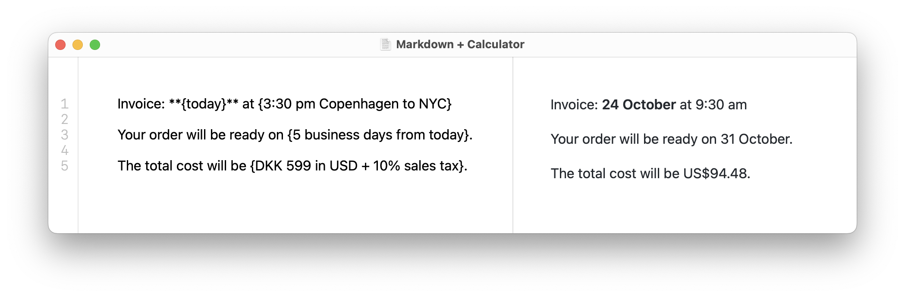
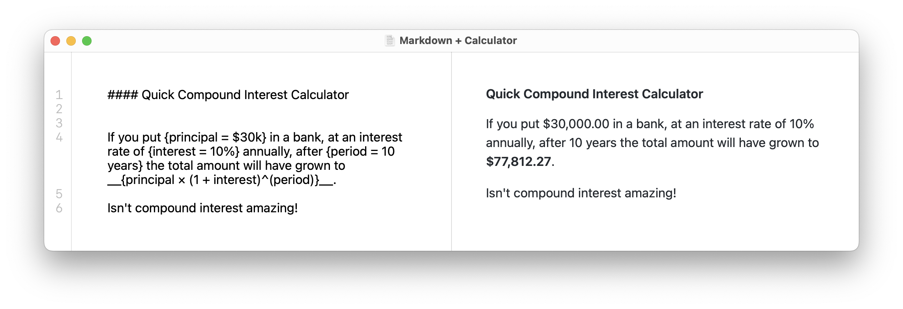

# Markdown + Calculator

This is an example Mac app demonstrating how [SoulverCore](https://soulver.app/core) can be used to add an inline calculation feature to a Markdown editor.

## Requirements

- Xcode 14+
- Swift 5.7+

You can download a pre-built sample from [here](https://github.com/soulverteam/MarkdownPlusCalculator/releases/download/1.0.0/MarkdownAndCalculation.zip)

## Acknowledgements
This demo was inspired by [Sundown](https://sundown.app) by [Laurent Baumann](https://github.com/lobau).

## License

Copyright (c) 2022 Acqualia Software OÜ. 
Markdown + Calculator is distributed under the MIT License. 
The use of the [SoulverCore](https://soulver.app/core) math engine in commercial software requires a special license.